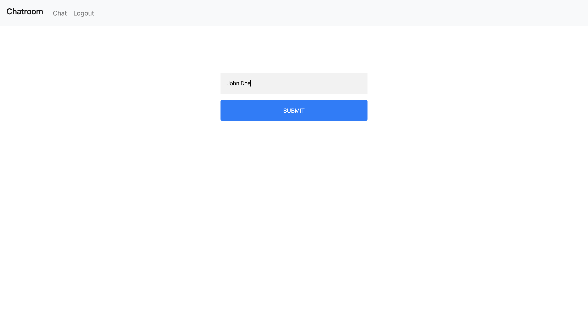

# Chatroom
Python web chatroom written using flask. 


## Usage
To run this application, it is recommended you use the built in virtual environment. 
You can do so by entering the src folder and typing the following command.

```bash
source env/bin/activate
```
Then you can install the necessary dependencies using pip.

```bash
pip3 install -r depencencies.txt
```

Then run:
```bash
python main.py
```
The program will run on your localhost on port 5500, you can then navigate to the url `http://127.0.0.1:5000` in your browser.

From there you should be greeted by a login screen.



You can enter a name and begin sending and receiving messages.


At any point you can enter `Ctrl-C` from your command line to terminate the program.
